# NinetyNinety - Elite Movie Discovery Platform


A curated movie discovery platform showcasing only the absolute best films - those with both 90%+ critics score AND 90%+ audience score on Rotten Tomatoes.

## 🚀 Tech Stack

- **Frontend**: Next.js 14+ with App Router
- **UI Library**: Chakra UI v3 (NO Tailwind CSS)
- **Database**: Supabase (PostgreSQL) with native client
- **Language**: TypeScript
- **Package Manager**: Bun
- **Code Quality**: Biome
- **Testing**: Bun (unit) + Playwright (E2E)

## 🗂️ Project Architecture



```mermaid
graph TD
    A[ninetyninety/] --> B[src/]
    A --> C[database/]
    A --> D[scripts/]
    A --> E[tests/]
    A --> F[docs/]
    A --> G[public/]
    A --> H[Config Files]
    
    %% src directory
    B --> B1[app/]
    B --> B2[components/]
    B --> B3[lib/]
    B --> B4[types/]
    
    %% app directory
    B1 --> B1A[api/]
    B1 --> B1B[movies/]
    B1 --> B1C[page.tsx]
    B1 --> B1D[layout.tsx]
    B1 --> B1E[loading.tsx]
    
    %% components directory
    B2 --> B2A[MovieGrid.tsx]
    B2 --> B2B[ui/]
    
    %% lib directory
    B3 --> B3A[database.ts]
    B3 --> B3B[supabase.ts]
    B3 --> B3C[config.ts]
    
    %% types directory
    B4 --> B4A[database.ts]
    
    %% database directory
    C --> C1[schema.sql]
    C --> C2[README.md]
    
    %% scripts directory
    D --> D1[setup-database.ts]
    D --> D2[seed-database.ts]
    D --> D3[check-database.ts]
    
    %% tests directory
    E --> E1[e2e/]
    E --> E2[unit/]
    
    %% docs directory
    F --> F1[ARCHITECTURE.md]
    
    %% public directory
    G --> G1[Static Assets]
    
    %% Config files
    H --> H1[package.json]
    H --> H2[tsconfig.json]
    H --> H3[biome.json]
    H --> H4[PROJECT.md]
    H --> H5[README.md]
    
    %% Click handlers for main directories
    click A "https://github.com/foxyblocks/ninetyninety" "Project Root"
    click B "https://github.com/foxyblocks/ninetyninety/tree/main/src" "Source Code"
    click C "https://github.com/foxyblocks/ninetyninety/tree/main/database" "Database Schema"
    click D "https://github.com/foxyblocks/ninetyninety/tree/main/scripts" "Automation Scripts"
    click E "https://github.com/foxyblocks/ninetyninety/tree/main/tests" "Test Suite"
    click F "https://github.com/foxyblocks/ninetyninety/tree/main/docs" "Documentation"
    
    %% Styling
    classDef rootStyle fill:#e1f5fe,stroke:#01579b,stroke-width:3px
    classDef srcStyle fill:#f3e5f5,stroke:#4a148c,stroke-width:2px
    classDef dbStyle fill:#e8f5e9,stroke:#1b5e20,stroke-width:2px
    classDef scriptStyle fill:#fff3e0,stroke:#e65100,stroke-width:2px
    classDef testStyle fill:#fce4ec,stroke:#880e4f,stroke-width:2px
    classDef configStyle fill:#f5f5f5,stroke:#424242,stroke-width:2px
    
    class A rootStyle
    class B,B1,B2,B3,B4 srcStyle
    class C,C1,C2 dbStyle
    class D,D1,D2,D3 scriptStyle
    class E,E1,E2 testStyle
    class H,H1,H2,H3,H4,H5 configStyle
```

### Directory Descriptions

- **`src/`** - Application source code
  - **`app/`** - Next.js App Router pages and API routes
    - **`api/`** - Server-side API endpoints
    - **`movies/`** - Movie detail and listing pages
    - **`page.tsx`** - Home page with movie grid
    - **`layout.tsx`** - Root layout with Chakra UI provider
    - **`loading.tsx`** - Loading state components
  - **`components/`** - Reusable React components
    - **`MovieGrid.tsx`** - Main movie display grid
    - **`ui/`** - UI primitives and theme providers
  - **`lib/`** - Core utilities and configurations
    - **`database.ts`** - Database query functions
    - **`supabase.ts`** - Supabase client setup
    - **`config.ts`** - Environment configuration
  - **`types/`** - TypeScript type definitions
    - **`database.ts`** - Database schema types

- **`database/`** - Database architecture
  - **`schema.sql`** - PostgreSQL schema with 50+ movie fields
  - **`README.md`** - Database setup documentation

- **`scripts/`** - Automation and maintenance scripts
  - **`setup-database.ts`** - Automated schema creation
  - **`seed-database.ts`** - Data population (future)
  - **`check-database.ts`** - Health checks

- **`tests/`** - Comprehensive test suite
  - **`e2e/`** - Playwright end-to-end tests
  - **`unit/`** - Bun unit tests

- **`docs/`** - Project documentation
  - **`ARCHITECTURE.md`** - Technical decisions and patterns

- **`public/`** - Static assets and icons

## 📋 Prerequisites

- [Bun](https://bun.sh/) installed
- [Node.js](https://nodejs.org/) 18.17 or later
- Supabase account (for database)
- TMDB API key (for movie data)

## 🛠️ Getting Started

1. **Clone the repository**
   ```bash
   git clone https://github.com/yourusername/ninetyninety.git
   cd ninetyninety
   ```

2. **Install dependencies**
   ```bash
   bun install
   ```

3. **Set up environment variables**
   ```bash
   cp .env.example .env.local
   ```
   Then edit `.env.local` with your actual values.

4. **Run the development server**
   ```bash
   bun dev
   ```

   Open [http://localhost:3000](http://localhost:3000) with your browser.

## 📝 Available Scripts

- `bun dev` - Start development server
- `bun build` - Build for production
- `bun start` - Start production server
- `bun check` - Run Biome linting and formatting checks
- `bun check:fix` - Fix linting and formatting issues
- `bun format` - Format code with Biome
- `bun test` - Run unit tests
- `bun test:watch` - Run tests in watch mode
- `bun test:coverage` - Run tests with coverage
- `bun test:e2e` - Run E2E tests
- `bun test:e2e:ui` - Run E2E tests with UI
- `bun test:e2e:debug` - Debug E2E tests

## 🏗️ Project Structure

```
ninetyninety/
├── src/
│   ├── app/              # Next.js App Router pages
│   │   ├── api/          # API routes
│   │   ├── movies/       # Movie-related pages
│   │   ├── layout.tsx    # Root layout with Chakra UI
│   │   └── page.tsx      # Home page
│   ├── components/       # React components
│   ├── lib/              # Utility functions and configurations
│   └── types/            # TypeScript type definitions
├── tests/
│   ├── unit/             # Unit tests
│   └── e2e/              # End-to-end tests
├── public/               # Static assets
├── PROJECT.md            # Detailed project documentation
├── CLAUDE.md             # AI assistant guidelines
└── biome.json            # Biome configuration
```

## 🧪 Testing

Run unit tests:
```bash
bun test
```

Run E2E tests (uses port 3001 by default):
```bash
bun test:e2e

# Or with a custom port:
PORT=3002 bun test:e2e
```

**Note:** E2E tests use port 3001 by default to avoid conflicts with your development server. See [tests/e2e/README.md](tests/e2e/README.md) for more details.

## 🎨 UI Guidelines

- **NO TAILWIND CSS** - We exclusively use Chakra UI v3
- Follow Chakra UI's component-based approach
- Use Chakra UI's design tokens for consistency
- Implement responsive design using Chakra UI's responsive arrays

## 📚 Documentation

- [PROJECT.md](./PROJECT.md) - Detailed project specifications
- [docs/ARCHITECTURE.md](./docs/ARCHITECTURE.md) - Database architecture and design decisions
- [database/README.md](./database/README.md) - Database setup and patterns

## 🤝 Contributing

Please read the project documentation before contributing. Ensure all code follows our linting and formatting standards by running `bun check` before committing.

## 📄 License

[MIT License](LICENSE)
